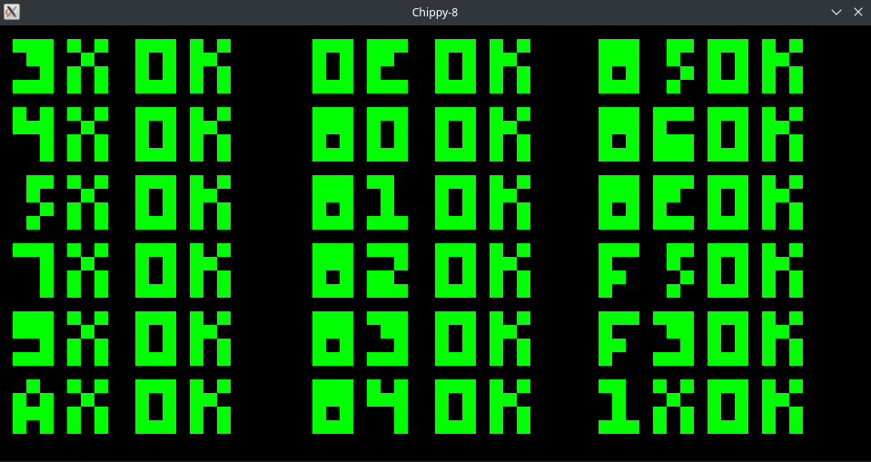
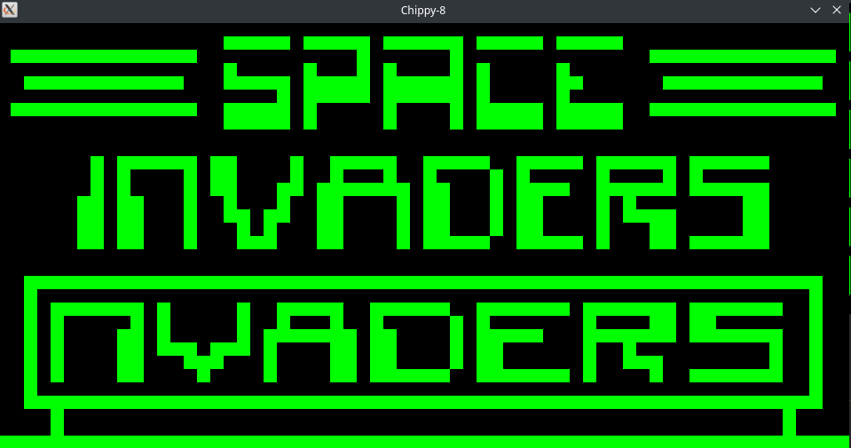
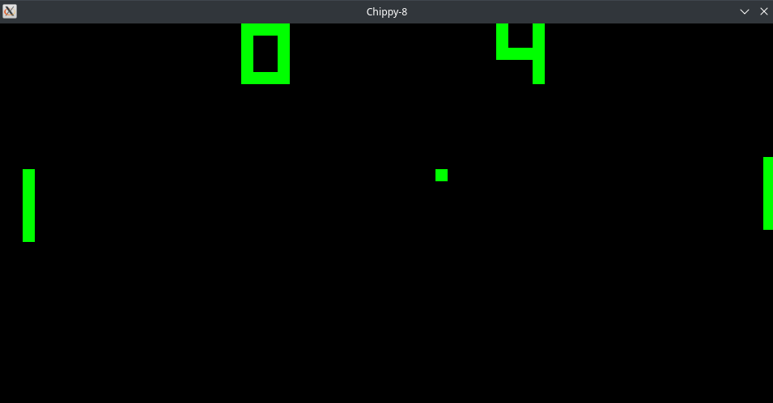

# Chippy-8
A fast Chip 8 Emulator written in C.

## Building

#### 1. Install the dependencies

* Ubuntu/Debian:
```    
$ sudo apt install build-essential libsdl2-dev git
```

* Arch
```
$ sudo pacman -S base-devel sdl2 git
```

#### 2. Clone the repo and cd into it:

```
$ git clone https://github.com/Lu-Die-Milchkuh/Chippy-8.git && cd Chippy-8
```

#### 3. Compilation

**NOTE: For whatever reason compiling and linking the executable on Ubuntu doesnt work. It used to work the exact same way like on other distros. Idk what sh*t the Ubuntu Devs changed again.**
```
$ make
```

Then execute it like the following:
```
$ ./Chippy-8 <path_to_rom>
```
## Controls

The Original Chip-8 has the following Keyboard Layout:
```
1   2   3   C
4   5   6   D
7   8   9   E
A   0   B   F
```
which are mapped like the following on your keyboard
```
1   2   3   4
Q   W   E   R
A   S   D   F
Y   X   C   V
```

## Screenshots



